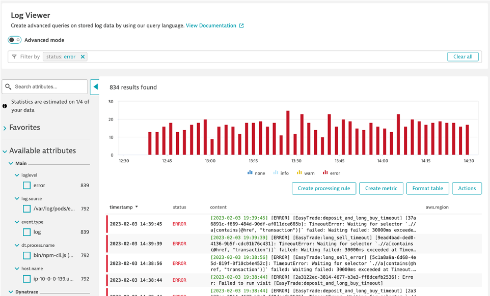

## Troubleshooting

We want to be able to see the newest error logs coming from our AWS Services

### Exercise Steps
- Navigate to the log viewer in Dynatrace
- Filter for only the Error Logs
- status=“error”
- Format the table: Add in AWS Region
- Action > Pin to Dashboard
