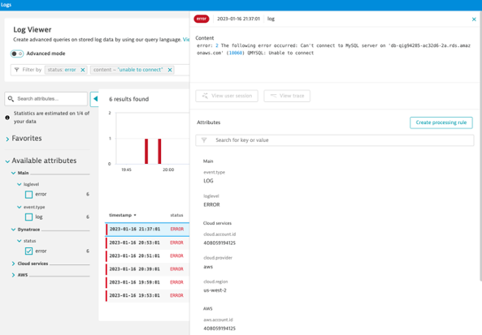
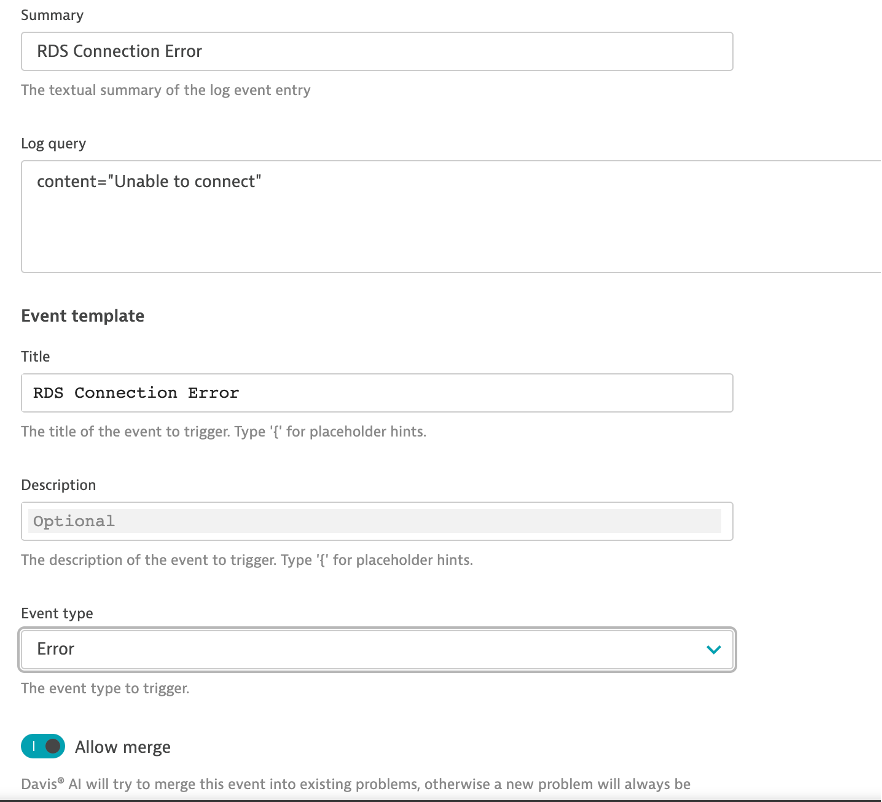

## Log Event

- I shouldn’t see any connection issues coming from my RDS instance, but it’s happened in the past
- When that happens, I want Dynatrace to create a log event and alert on it. 



### Find the RDS Log
- First let’s find the RDS connect error log records (search content: unable to connect)
- Search content:

```bash
unable to connect
```

### Create Log Event
- Now that we know what it looks like, let’s create an event on it.
- Navigate to Settings> Log Monitoring> Events Extraction
- Add log event
- Summary: RDS Connection Error
- Log Query:
```bash
content="Unable to connect"
```
- Title: RDS Connection Error
- Event Type: Error
- Allow to Merge
- Save Changes

