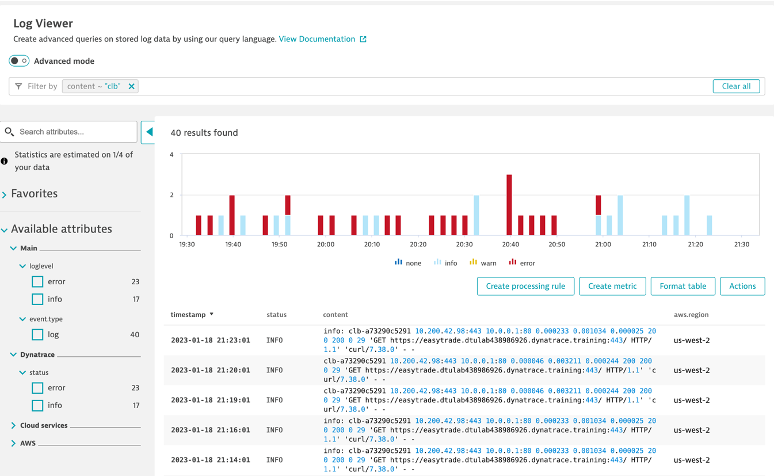
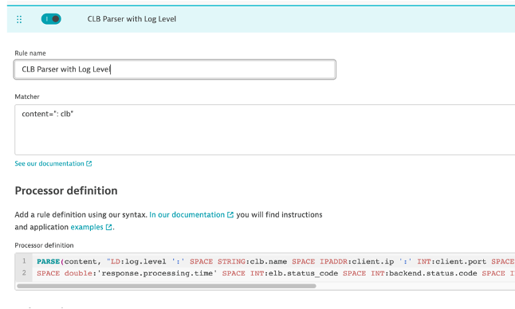
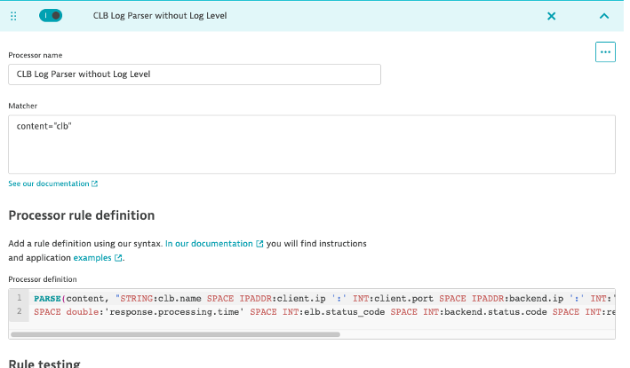
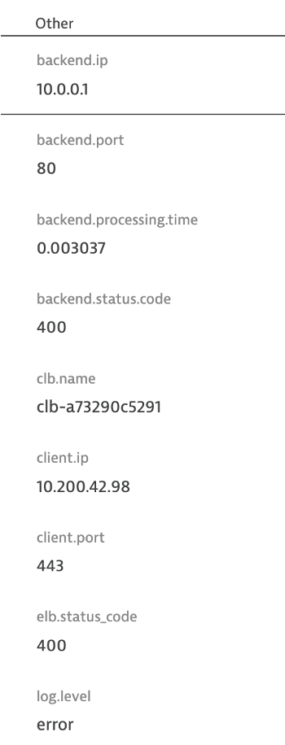
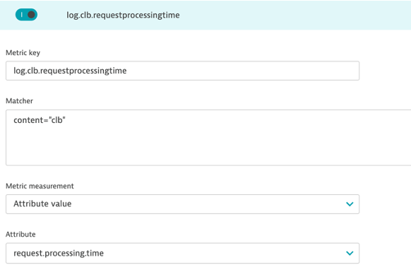
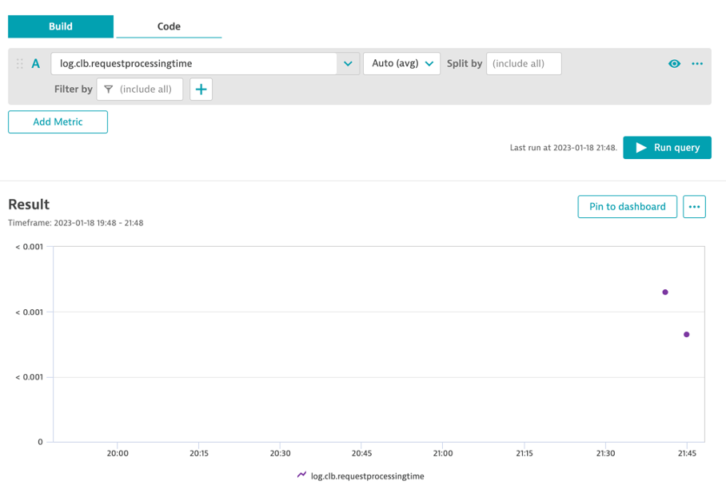

## Log Metric

- We’ve seen some spikes in response time and want to see if the CLB is part of the problem
- I want to create a metric off request processing time that’s found in the CLB logs and track it over time


### First let’s look at the CLB logs
- In the log viewer, search for
```bash
content="clb"
```
- Notice how there’s a lot of numbers in the log?
- We can parse these to use them in queries and metrics!
- Click Create processing rule



### CLB Log Parser with log level
- We need to create 2 parsers because sometimes the logs have info: or error: in front of the content and sometimes it doesn’t.
- The parsers are prioritized top down, so the way we order the parsing rules changes the way Dynatrace applies them
- This rule is for the logs that have the log level in them
- Rule Name: CLB Log Parser with log level
- Matcher:
``` bash
content=": clb"
```
- Parser:
```bash
PARSE(content, "LD:log.level ':' SPACE STRING:clb.name SPACE IPADDR:client.ip ':' INT:client.port SPACE IPADDR:backend.ip ':' INT:'backend.port' SPACE double:'request.processing.time' SPACE double:'backend.processing.time'
SPACE double:'response.processing.time' SPACE INT:elb.status_code SPACE INT:backend.status.code SPACE INT:recieved.bytes SPACE INT:sent.bytes SPACE STRING:request SPACE")
```
- Test the parser and hit save




### CLB Log Parser without log level
- This parser is for logs that DO NOT have log level in them
- Rule Name: CLB Log Parser without log level
- Matcher:
``` bash
content="clb"
```
- Parser:
```bash
PARSE(content, "STRING:clb.name SPACE IPADDR:client.ip ':' INT:client.port SPACE IPADDR:backend.ip ':' INT:'backend.port' SPACE double:'request.processing.time' SPACE double:'backend.processing.time'
SPACE double:'response.processing.time' SPACE INT:elb.status_code SPACE INT:backend.status.code SPACE INT:recieved.bytes SPACE INT:sent.bytes SPACE STRING:request SPACE")
```
- Test the parser and hit save
- Ensure the "without" log level rule is under the "with" rule. You may have to click and drag the rules to re-order them.




### Create the Metric
- Now that the log is parsed out, let’s take a look at how new CLB logs look in the log viewer. 
- Navigate back to the log viewer
- All of these attributes can be used for log metrics!



- Click Create Metric  
- Metric key: log.clb.requestprocessingtime
- Matcher:  content="clb"
- Metric Measurement: Attribute Value
- Attribute: request.processing.time
- Click Save changes




### Add the metric to the dashboard
- Navigate to Data Explorer
- Type in log.clb to find your metric
- Run Query
- Pin to dashboard

