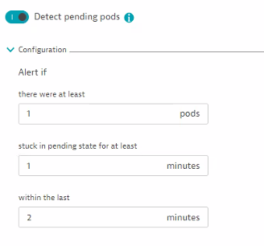

## Built-in Alerting

### Enable and test a built-in alert!

1. Navigate to Settings > Anomaly detection> Kubernetes/Workload
2. Enable **Detect pending pods***
3. Expand the Configuration section and set pending state for at least **1** minutes within last **2** minutes.
> NOTE: Original values are 10 minutes in last 15 minutes



4. In your shell run the following command to scale up the **loginservice** to far exceed capacity:

```bash
kubectl scale --replicas=100 deployment/loginservice -n easytrade
```

5. Run the following command and note pods that are stuck in a **Pending** state:

```bash
kubectl get pods -l app=loginservice -n easytrade
```

6. A "Pending pods" problem will open in a few minutes


7. Run the following command to scale the **loginservice** down to 3 replicas:

```bash
kubectl scale --replicas=3 deployment/loginservice -n easytrade
```
