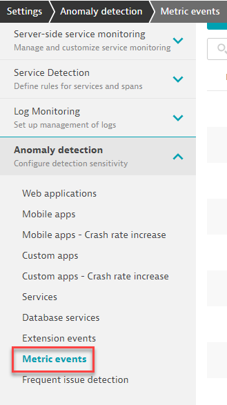
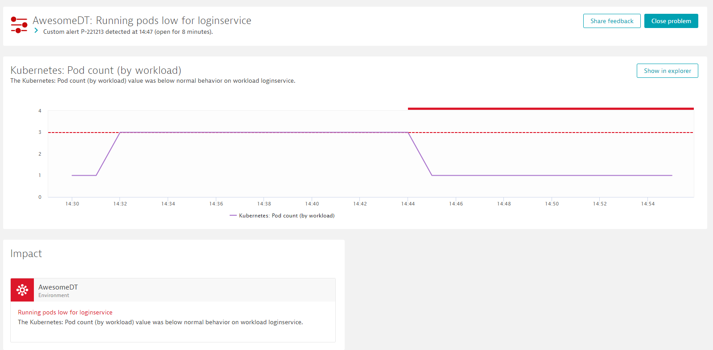

## Custom Alerting

### Configure a custom alert based on running pods metric

1. Navigate to Settings > Anomaly detection > Metric events



2. Click the **Add metric event** button
3. Configure the new metric event with the following details
- Summary: *Running pods low*
- Type: *Metric key*
- Metric key: *Kubernetes: Pod count (by workload)*
- Aggregation: *Maximum*
- Configure an entity filter: *Name equals loginservice*
- Threshold: *3*
- Alert condition: *Alert if metric is below*
- Advanced Model Properties: 
-- Violating Samples: 1
-- Sliding Window: 3
-- Dealerting Samples: 3
- Event title: *Running pods low for loginservice*
- Description: *The {metricname} value was {alert_condition} normal behavior on workload {dims:k8s.workload.name}.*
- Event type: *Custom*
- Click the **Save** changes button
4. In your shell run the following command to furth scale the **loginservice** down to a single pod:

```bash
kubectl scale --replicas=1 deployment/loginservice -n easytrade
```

5. A problem will trigger within 5 minutes



6. Adjust the threshold on the previously created metric event to **1** to clear the problem
