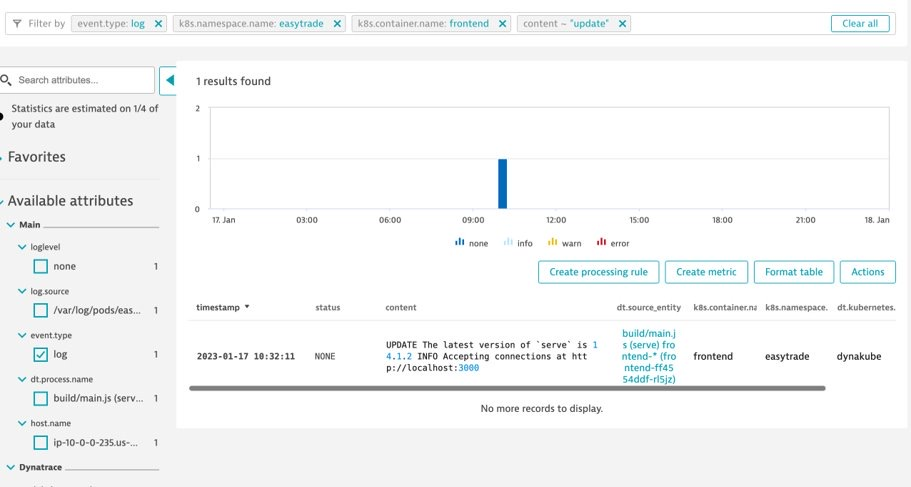

## Charting Logs

### Exercise Steps

1. Navigate to the Logs & Events Viewer
2. Filter by event.type: log
>- event.type
>- log
```bash
event.type="log"
```
3. Click into an log entry to see what attributes are captured
4. Add a filter for our namespace
>- k8s.namespace.name
>- easytrade
```bash
event.type="log" AND k8s.namespace.name="easytrade"
```
5. Add a filter for our container
>- k8s.container.name
>- frontend
```bash
event.type="log" AND k8s.namespace.name="easytrade" AND k8s.container.name="frontend"
```
6. Filter the content for "update"
>- content
>- update
```bash
event.type="log" AND k8s.namespace.name="easytrade" AND k8s.container.name="frontend" AND content="update"
```
7. Format the table by adding the fields below:
>- dt.source_entity
>- k8s.container.name
>- k8s.namespace.name
>- dt.kubernetes.cluster.name
8. Pin the table to your dashboard
>- Title: EasyTrade Frontend Updates


